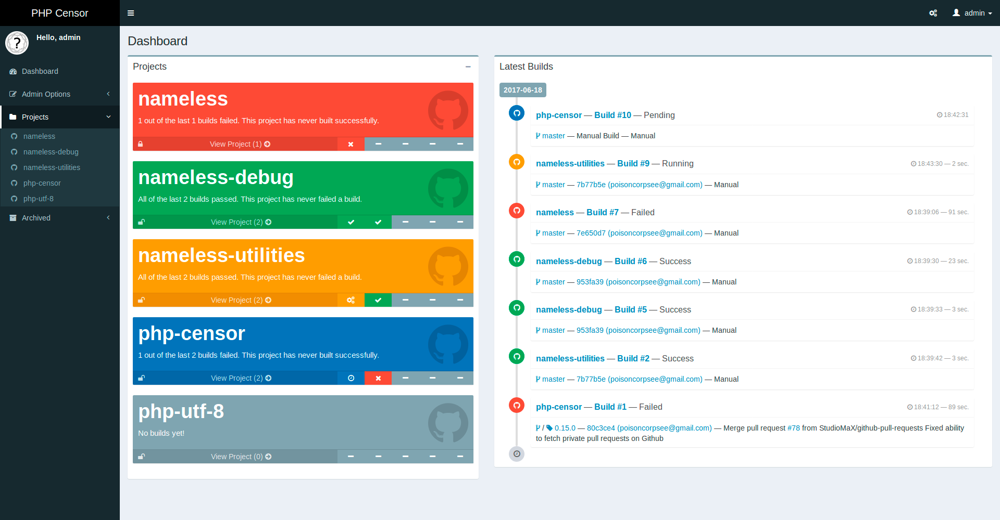

PHP Censor
==========

**PHP Censor** is a fork of [PHPCI](https://www.phptesting.org)
(And [B8Framework](https://github.com/Block8/b8framework)) and is a open source
([BSD-2-Clause license](LICENSE.md)) continuous integration tool specifically designed for PHP.

What it does
------------

* Clones your project from Github, Bitbucket, Gitlab or Git;

* Allows you to set up and tear down test databases;

* Installs your project's Composer dependencies;

* Runs through any combination of the [supported plugins](docs/en/README.md));

[](docs/screenshots/dashboard.png)

More [screenshots](docs/en/screenshots.md).

Configuring
-----------

Similar to [TravisCI](https://travis-ci.org), to support PHP Censor in your project, you simply need to add a `.php-censor.yml`
(`phpci.yml`/`.phpci.yml` for backward compatibility with PHPCI) file to the root of your repository. The file should
look something like this:

```yml
setup:
  composer:
    action: "install"
test:
  php_unit:
    config: "phpunit.xml"
  php_mess_detector:
    allow_failures: true
  php_code_sniffer:
    standard: "PSR2"
  php_cpd:
    allow_failures: true
complete:
  email:
    default_mailto_address: admin@php-censor.local
```

More details about [configuring project](docs/en/config.md).

Installing
----------

You will need PHP 5.6+ (with OpenSSL support and enabled functions: `exec()`, `shell_exec()` and `proc_open()`)
with web-server (Nginx or Apache2), MySQL (or MariaDB) database and Composer.

* Go to the directory in which you want to install PHP Censor, for example: `/var/www`;

* Download PHP Censor from this repository and unzip it (to `/var/www/php-censor.local` for example);

* Go to the PHP Censor directory: `cd /var/www/php-censor.local`;

* Install dependencies using Composer: `composer install`;

* Create empty MySQL database for application;

* Install Beanstalkd queue (`aptitude install beanstalkd`);

* Install PHP Censor itself: `./bin/console php-censor:install`;

* [Add a virtual host to your web server](docs/en/virtual_host.md), pointing to the `public` directory within your new
PHP Censor directory. You'll need to set up rewrite rules to point all non-existent requests to PHP Censor;

* [Set up the PHP Censor Worker](docs/en/workers/worker.md), or you can run builds using the
[daemon](docs/en/workers/daemon.md) or [a cron-job](docs/en/workers/cron.md) to run PHP Censor builds;

More details about [installation](docs/en/installing.md).

Updating
--------

* Go to your PHP Censor directory (to `/var/www/php-censor.local` for example);

* Pull the latest code. This would look like this: `git pull`;

* Update the PHP Censor database: `./bin/console php-censor-migrations:migrate`;

* Update the Composer dependencies: `composer update`

Tests
-----

```bash
cd /path/to/php-censor
./vendor/bin/phpunit
```

For Phar plugin tests set 'phar.readonly' setting to Off (0) in `php.ini` config. Otherwise tests will be skipped.

For database B8Framework tests create empty 'b8_test' MySQL database on 'localhost' with user/password: `root/root`.
Otherwise database tests will be skipped.

Migrations
----------

Run to apply latest migrations:

```bash
cd /path/to/php-censor
./bin/console php-censor-migrations:migrate
```

Run to create new migration:

```bash
cd /path/to/php-censor
./bin/console php-censor-migrations:create NewMigrationName
```

Documentation
-------------

[Full PHP Censor documentation](docs/en/README.md).

License
-------

PHP Censor is open source software licensed under the [BSD-2-Clause license](LICENSE.md).
